# Reto 2
Navegación

## Objetivo

Identificar los elementos de navegación en los siguientes sites.

   * Breather

   * Github

   * Medium
   
  
 ## Breather   
 
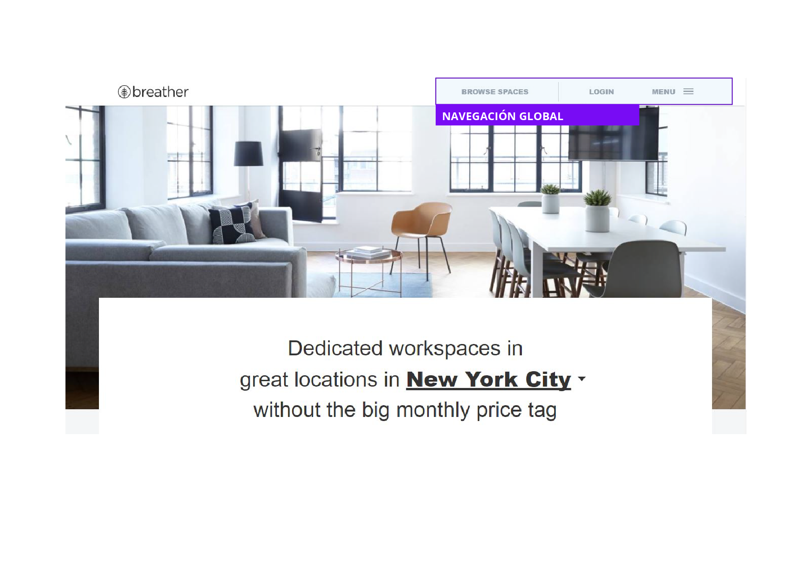

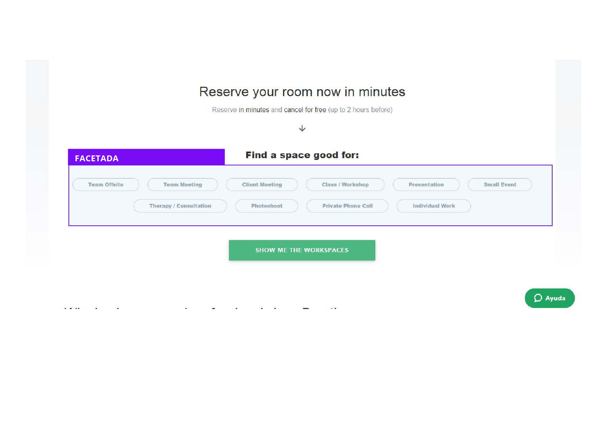

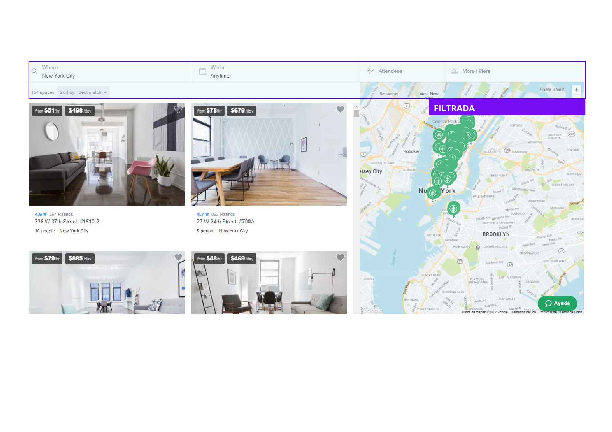

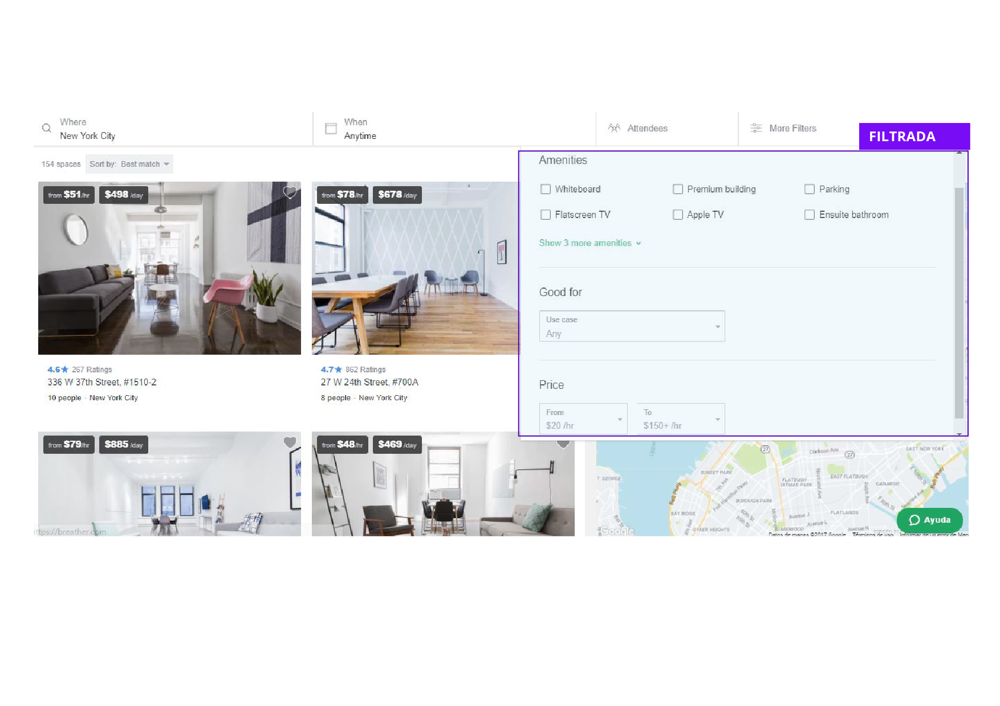

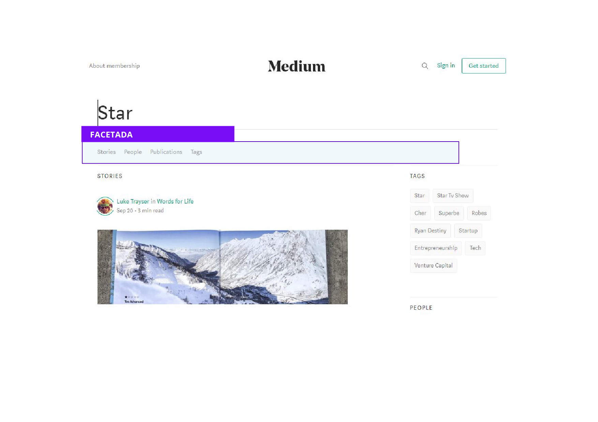

 ## Github   
 
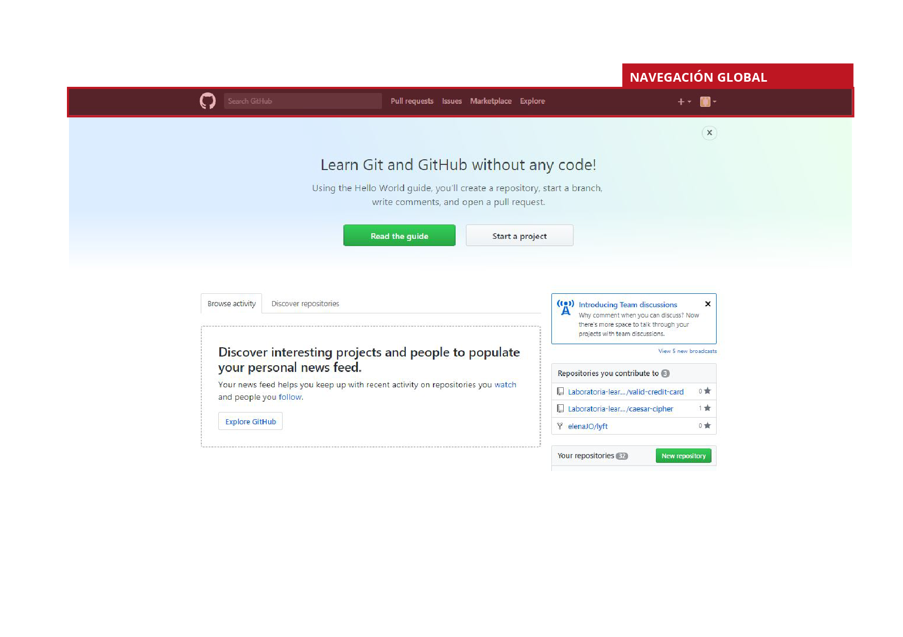
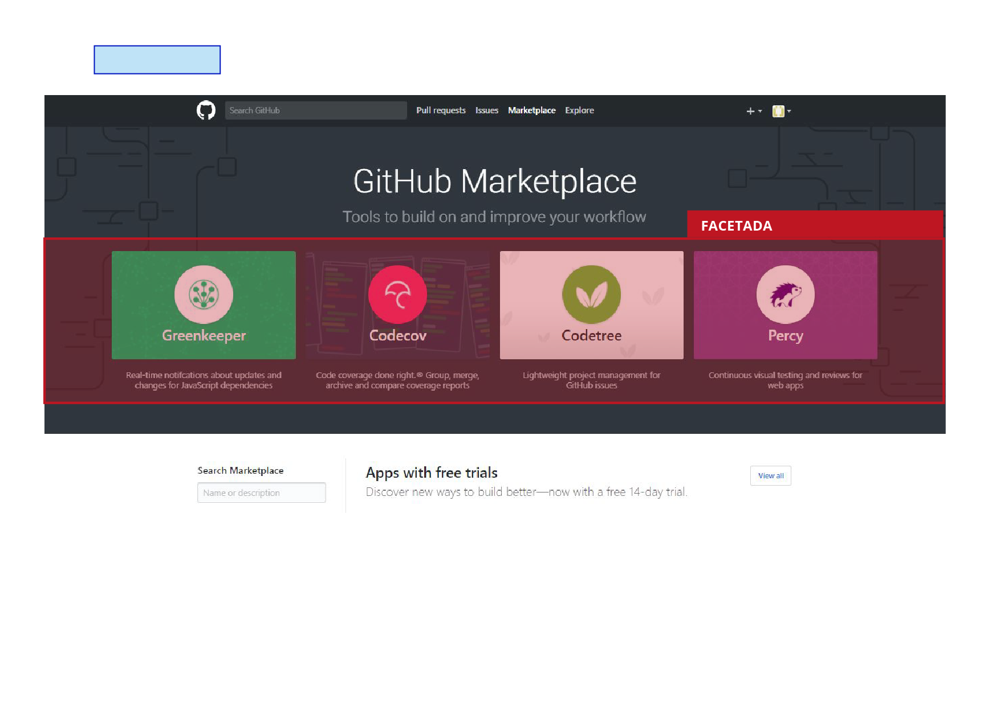
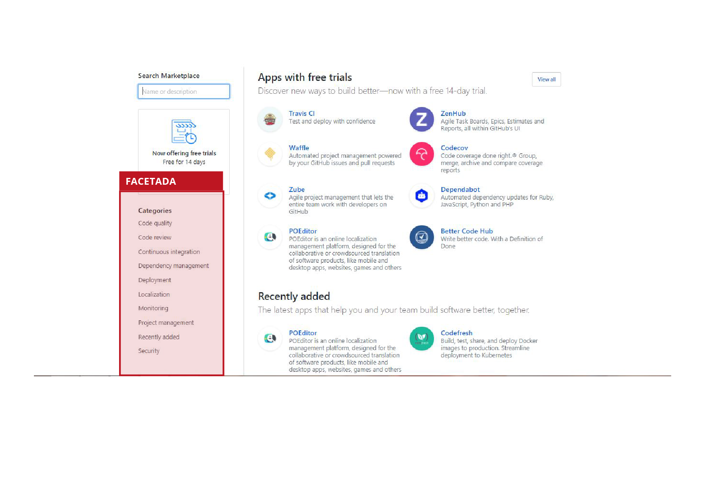
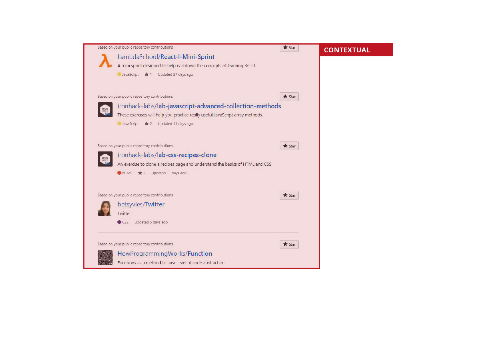
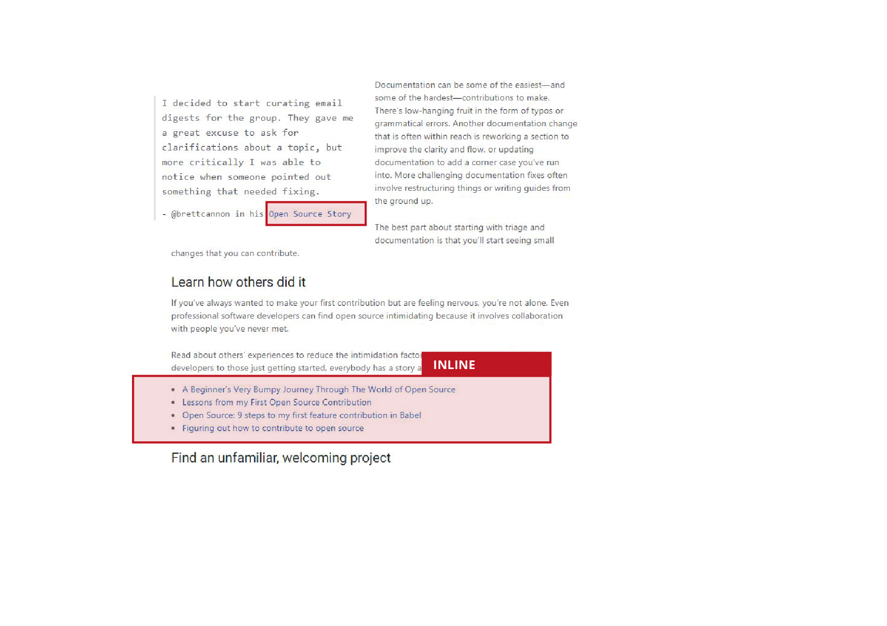
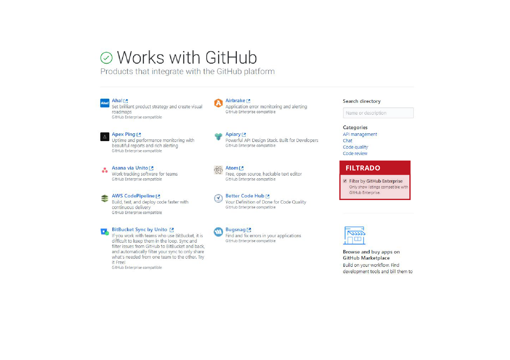

 ## Medium
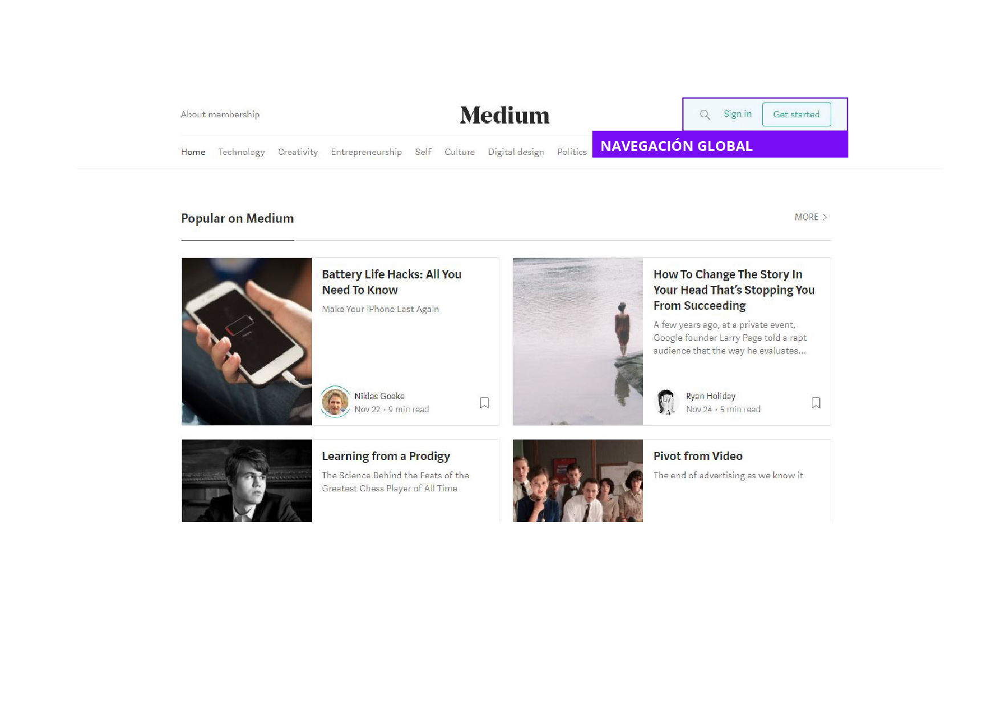
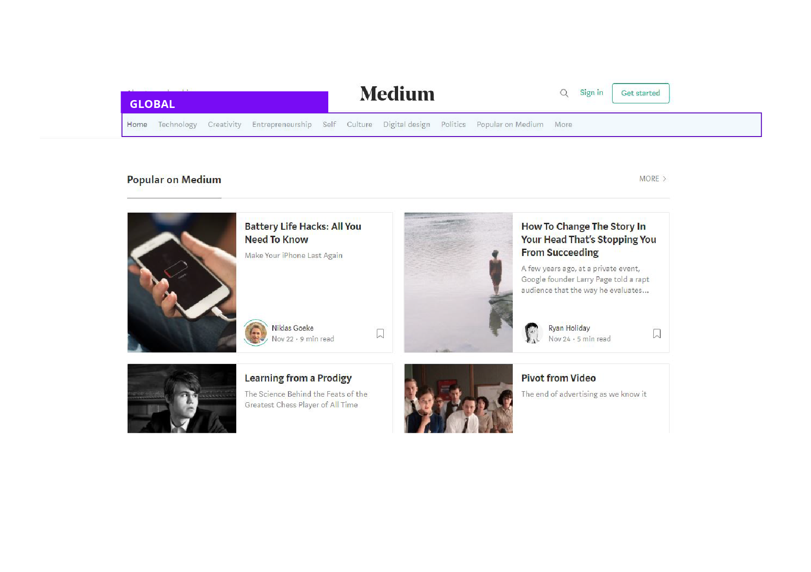
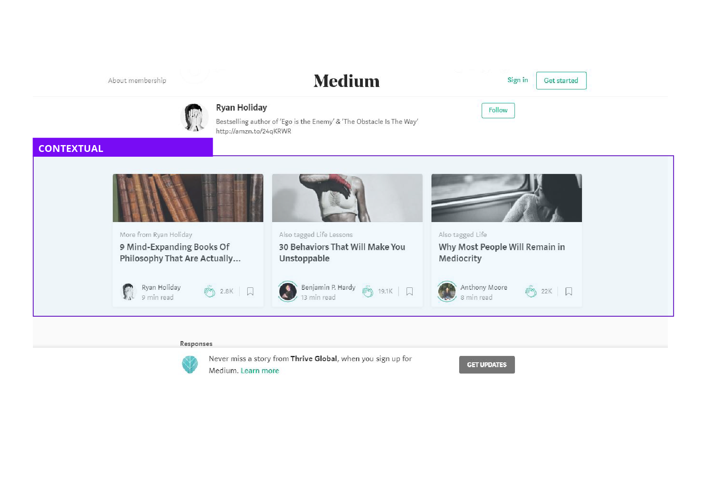

 
